# Capítulo IV: Product Design

En este capítulo se detallan las decisiones de diseño de producto para la plataforma **Buildline** y su respectiva Landing Page. Se establecen las guías de estilo visuales, la arquitectura de la información y los criterios que aseguran una experiencia de usuario (UX) intuitiva y profesional, alineada a las exigencias del sector construcción y la gestión logística de obras.

## 4.1. Style Guidelines

### 4.1.1. General Style Guidelines

El diseño visual de la plataforma **Buildline** se rige por una estética robusta, tecnológica y de alta eficiencia operativa, reflejando el compromiso con la eliminación de la informalidad y la integridad de la trazabilidad en la cadena de suministro. El objetivo es proyectar un entorno de control y profesionalismo que minimice la carga cognitiva tanto del residente en campo como del jefe de logística en la oficina.

En este capítulo, detallaremos cada uno de los elementos visuales y de estilo que guían el desarrollo de la aplicación Buildline, siempre siguiendo los principios de Diseño de Experiencia de Usuario (UX) e Interfaz de Usuario (UI) para garantizar la máxima usabilidad bajo condiciones de obra.

**Branding**

El logotipo principal de Buildline está compuesto por un isotipo que integra múltiples elementos semánticos de nuestro dominio técnico: 
* **La Línea Continua:** Una 'B' estilizada formada por un trazo ininterrumpido que simboliza un flujo logístico eficiente y sin fin, respondiendo a la necesidad de trazabilidad absoluta.
* **El Edificio Modular:** Integrado en la parte superior del bucle, evoca el progreso de la obra y la finalización exitosa del proyecto gracias a un abastecimiento oportuno.
* **Nodos de Conexión:** Los pequeños círculos representan la integración digital de requerimientos, cotizaciones y órdenes de compra, eliminando el caos de aplicaciones informales como WhatsApp.

 

  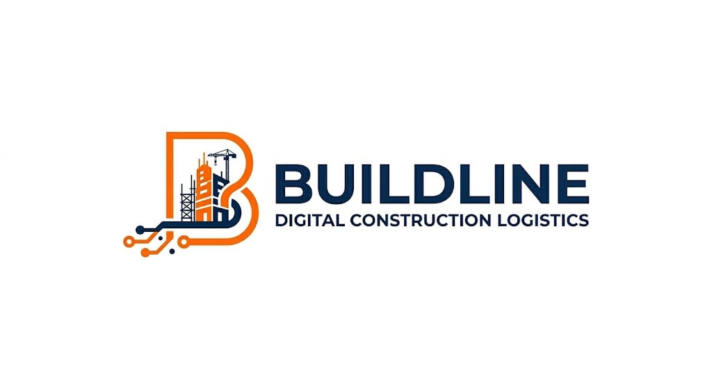

 

**Typography**

La tipografía empleada en Buildline será **Montserrat**, con sus variantes Regular, Medium, SemiBold y Bold. La elección de Montserrat se basa en su estética geométrica y sólida que evoca la resistencia de la construcción, equilibrada con una legibilidad perfecta para revisar presupuestos y listas de materiales en pantallas móviles bajo el sol o en oficinas. Además, su disponibilidad a través de Google Fonts asegura una carga eficiente.

La jerarquía tipográfica se establece de la siguiente manera para garantizar claridad y ritmo visual:
* **Títulos principales (H1/Sección heading):** 5rem (aprox. 50px) en escritorio, 4.5rem (aprox. 45px) en móvil.
* **Subtítulos (H2/Sub-headings):** 3rem (aprox. 30px) en escritorio.
* **Títulos de componentes (H3/H4):** 2rem (aprox. 20px) a 2.5rem (aprox. 25px).
* **Cuerpo del texto (p):** 1.6rem (aprox. 16px) con un interlineado de 1.6.
* **Botones y etiquetas (span):** 1.4rem (aprox. 14px) a 1.8rem (aprox. 18px).

  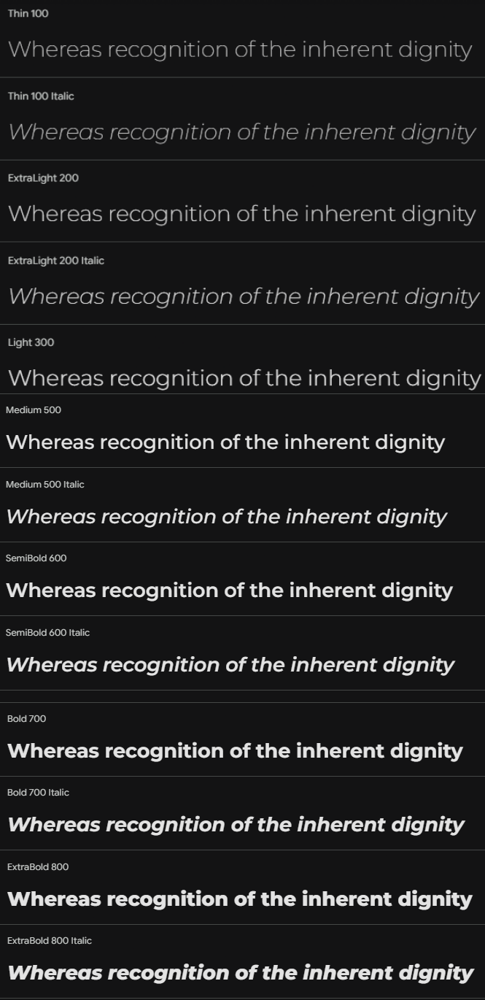

Esta distribución garantiza un contraste óptimo entre el texto y el fondo, superando un ratio mínimo de 4.5:1 según las WCAG 2.1 AA para una accesibilidad superior en entornos de campo.

**Colors**

Nuestra paleta de colores ha sido cuidadosamente seleccionada para evocar sensaciones de control corporativo, acción operativa e innovación. Se ha distribuido en tres categorías principales:

* **Paleta principal:** Colores que definen la identidad de Buildline y se usan en elementos clave.
    * **Primario (Deep Navy Blue):** Transmite autoridad, formalidad profesional y seguridad. Utilizado en menús de oficina y presupuestos.
    * **Secundario (Vibrant Orange):** Representa la energía de la obra en campo y la velocidad logística. Utilizado para llamados a la acción (CTAs) y botones urgentes.
    * **Terciario (Tech Cyan):** Evoca la conectividad y la nube. Utilizado para marcadores de estado y trazabilidad.
    * **Fondo Claro:** Proporciona un entorno visual limpio para tablas de cotizaciones.
    * **Fondo Blanco:** Fondos de tarjetas de requerimientos y paneles de control.
* **Paleta de Soporte:** Colores complementarios que añaden profundidad y contraste.
    * **Gris Neutro:** Para bordes sutiles, líneas divisorias y separadores de listas de materiales.
* **Colores Funcionales:** Reservados para comunicar estados críticos al usuario.
    * **Éxito:** Verde para órdenes de compra aprobadas y materiales entregados.
    * **Error:** Rojo para presupuestos excedidos o alertas de retraso.
    * **Advertencia:** Amarillo para quiebres de stock o requerimientos pendientes.

  

Esta combinación cromática refleja los valores de nuestra marca y busca transmitir al público (constructoras y gerentes de proyecto) una imagen de rigor, velocidad y control financiero.

**Spacing**

El espaciado en Buildline sigue un sistema modular para garantizar un ritmo visual armonioso y una jerarquía clara. La consistencia en el espaciado ayuda a reducir el estrés administrativo del usuario frente a largas listas de inventario.
* **Espaciado Básico:** Usamos un espaciado base en el sistema de grid, multiplicado para crear espacios mayores.
* **Margen Interno (Padding) Generoso:** Las secciones principales utilizan un padding vertical de 5rem (50px) para crear pausas visuales. Los contenedores de requerimientos usan padding menor (30px - 40px) para agrupar datos lógicamente.
* **Espacio entre Elementos:** El espaciado entre tarjetas de obra o cotizaciones varía entre 3rem y 5rem, manteniendo una densidad de información adecuada sin abrumar visualmente al jefe de logística.
* **Line Height del Texto:** Interlineado configurado en 1.6, facilitando la lectura de especificaciones técnicas de materiales.

**Tono de Comunicación**

La voz y el tono de Buildline están diseñados para ser tan resolutivos y estructurados como nuestra plataforma. Nuestro objetivo es conectar tanto con Residentes de Obra (campo) como con Gerentes Generales (gabinete).
* **Tono: Formal pero orientado a la acción.** Buscamos proyectar autoridad en el control de costos, manteniendo el dinamismo que exige el trabajo en obra.
* **Actitud: Resolutiva y ágil.** El 90% de nuestra comunicación se orienta a la eficiencia ("Cero retrasos", "Aprobaciones en un clic"), mientras que el 10% es persuasiva para incentivar la adopción del sistema.
* **Lenguaje: Técnico y directo.** Hablamos el idioma de la construcción (ej. Órdenes de Compra, Valorizaciones, Requerimientos, Cuadrillas, RFI). Nos enfocamos en la rentabilidad y la reducción de sobrecostos.
* **Voz: Experta y moderna.** Posicionamos a Buildline como el fin de la informalidad y la llegada de la Industria 4.0 a la construcción peruana.

### 4.1.2. Web Style Guidelines

Las directrices de estilo web de **Buildline** se centran en la velocidad operativa, la inmutabilidad del historial de compras y la facilidad de uso. Nuestro objetivo es crear una experiencia visual que digitalice el flujo de abastecimiento con un diseño limpio e intuitivo, especialmente para usuarios en campo con baja conectividad.

**1) Layout**
* **Sistema de Grid:** Utilizamos un diseño de cuadrícula flexible para garantizar que Buildline se adapte perfectamente. Esto permite que las tablas de cotizaciones complejas se condensen fluidamente en pantallas pequeñas.
* **Headers y Footers:** El encabezado es fijo, proporcionando acceso a la navegación y botones de acceso. El pie de página centraliza enlaces, contacto y soporte técnico.
* **Cards:** Las tarjetas estructuran información crítica, como los requerimientos de Obra pendientes. Cuentan con bordes redondeados y sombras suaves para facilitar la rápida lectura de prioridades.

**2) Responsive Design**
* **Desktop:** Optimizado para la oficina de logística y gerencia. Menús laterales completos y grillas de datos expansivas para comparar cotizaciones en pantallas grandes.
* **Tablet:** Interfaz adaptada para supervisores de obra, con botones táctiles ampliados para el uso en movimiento.
* **Mobile (Mobile-First para Campo):** La experiencia móvil es ultra-ligera (Low-Data). Menú de hamburguesa y botones masivos para generar requerimientos fácilmente incluso con una sola mano y guantes de obra.

**3) Interaction Design**
* **Botones:** Llamativos utilizando el "Vibrant Orange" para acciones principales (Aprobar, Enviar Requerimiento). Efectos lineales al pasar el cursor confirman la interactividad.
* **Formularios:** Extremadamente simplificados. Los campos de solicitud de material utilizan autocompletado predictivo para evitar que el operario de campo escriba largos textos.

**4) Images and Icons**
* **Imágenes:** Fotografías de alta calidad que evocan grandes infraestructuras, ingenieros utilizando tablets en campo y almacenes ordenados.
* **Íconos:** Estilo lineal y minimalista. Representan maquinaria, cascos, portapapeles y nodos de red para ofrecer una navegación visual intuitiva sin necesidad de leer mucho texto.

**5) Repositorio Central**
* **Organización:** Estructura lógica modular (`public/assets/images`, `public/assets/styles/style.css`, `public/assets/scripts/main.js`).
* **Versionado:** Uso estricto de Git para el control de versiones del equipo de desarrollo, garantizando despliegues seguros de la plataforma.

## 4.2. Information Architecture

La arquitectura de la información de **Buildline** está diseñada para una navegación intuitiva orientada a roles, permitiendo que Gerentes, Logísticos y Residentes encuentren exactamente lo que necesitan sin fricciones.

### 4.2.1. Organization Systems

* **Jerarquía de Contenidos:** La información va del impacto macro al detalle operativo. La Landing Page inicia con el dolor principal (retrasos) y la promesa de valor (trazabilidad).
* **Secciones Principales de la Landing Page:**
    * **Hero:** El fin del caos logístico en la construcción.
    * **What We Offer:** Visión general del flujo Requerimiento-Aprobación-Entrega.
    * **Features:** Aprobaciones móviles, control presupuestal, tracking de proveedores.
    * **Benefits:** Reducción de sobrecostos de emergencia (hasta 18%) y prevención de paralizaciones.
    * **About Us:** Nuestro compromiso con la formalización del sector.
    * **Plans:** Suscripciones adaptadas a constructoras MYPES y grandes corporaciones.
    * **Testimonials:** Respaldo de Jefes de Proyecto.
* **Agrupación de Contenidos:** Uso de pestañas y acordeones interactivos para clasificar funcionalidades técnicas sin saturar la pantalla.

### 4.2.2. Labeling Systems

* **Nomenclatura:** Lenguaje 100% de la industria ("Crear Requerimiento", "Comparar Cotizaciones", "Emitir OC"). Botones claros como "Request Demo".
* **Consistencia:** Unificación de términos en todo el SaaS (siempre se usa "Requerimiento", nunca se mezcla con "Pedido" u "Orden").
* **Lenguaje Adaptativo:** Accesible para operarios de campo sin jerga de software, pero con el rigor financiero que exige una gerencia.

### 4.2.3. Searching Systems

* **Barra de Búsqueda:** Dentro del SaaS, es la herramienta principal de la oficina. Ubicada en la parte superior para buscar por *Nombre de Proyecto*, *ID de Orden de Compra* o *Proveedor*.
* **Filtros y Facetas:** Filtros críticos por Estado (Pendiente, Aprobado, Rechazado, En Tránsito), Fechas y Rango de Costos.
* **Historial de Búsqueda:** Registro de materiales más solicitados para agilizar futuras cotizaciones.
* **Resultados Relevantes:** Priorización de requerimientos con etiqueta de "Urgente" o aquellos que superan el presupuesto base.

### 4.2.4. Navigation Systems

* **Navegación Global:** Barra de navegación superior fija en la Landing Page (`Home`, `Soluciones`, `Beneficios`, `Planes`).
* **Navegación Contextual:** Botones de llamado a la acción (CTAs naranjas) que guían al usuario fluidamente desde la lectura de un beneficio hasta la solicitud de una cuenta.

## 4.3. Landing Page UI Design

### 4.3.1. Landing Page Wireframe

El wireframe de la landing page de Buildline ha sido diseñado para reflejar una solución robusta, transparente y eficiente, atacando directamente la informalidad logística del sector construcción. La disposición de las secciones es la siguiente:

**Nav y Hero**

Esta sección presenta el logotipo de Buildline y el menú de navegación. El titular principal comunica la misión de la startup: "El fin del caos logístico en la construcción". El diseño visual integra widgets de control en tiempo real que muestran el Presupuesto de Materiales, indicadores de Eficiencia de Suministro y estados de almacenamiento (Cemento, Acero). Incluye un campo de registro rápido para que los gerentes de MYPES soliciten un demo de inmediato.

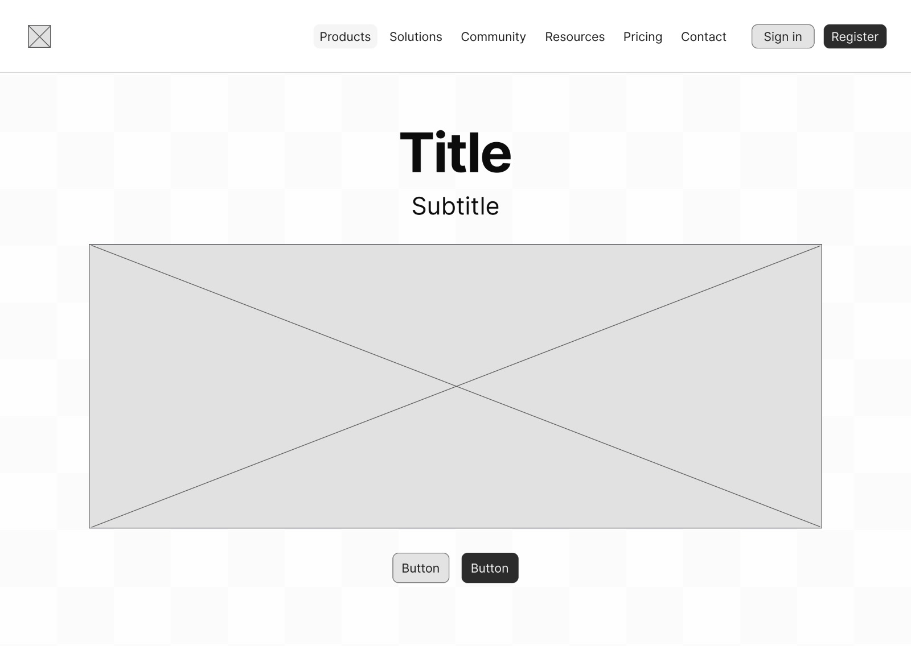

**Workflow**

Bajo el título "Todo lo que necesitas para gestionar y controlar tus proyectos", se detalla el flujo digital que reemplaza al WhatsApp/Excel en cuatro pasos:

**Dashboard y Control Operativo**

Esta sección unifica las capacidades críticas de análisis de la plataforma. Permite visualizar las desviaciones presupuestales antes de que se conviertan en pérdidas, gestionar el centro de alertas para aprobaciones jerárquicas en tiempo real y mantener una trazabilidad de compras total. El diseño está optimizado para que el Jefe de Logística priorice compras críticas, reduciendo el 12% de sobrecostos por compras de emergencia y garantizando que el insumo en obra coincida con la especificación técnica.

**Testimonials**

Bajo la sección "¿Por qué Buildline?", se presentan testimonios de roles clave (Dueños de obra, Supervisores de mercado y Gerentes de operaciones). Los mensajes validan la solución enfocándose en la eliminación de hojas de cálculo manuales, la reducción del estrés operativo y la capacidad de validar pedidos desde el campo sin necesidad de retornar a la oficina.

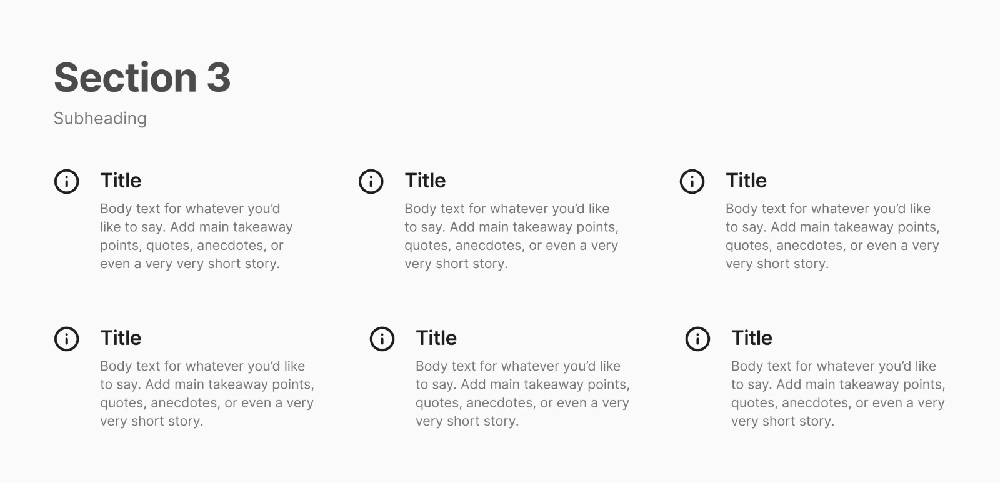

**Register** 

Define los tres pilares de la experiencia Buildline: Setup (creación estructurada de pedidos), Monitor (seguimiento de cotizaciones) y Control (detección temprana de quiebres de stock). Finaliza con un formulario de registro limpio que permite el acceso mediante credenciales institucionales o redes sociales (Google/Apple), reduciendo la fricción de entrada para el personal operativo.

**Pricing** 

Presenta la escalabilidad del modelo SaaS mediante dos planes: el Project Base Plan, ideal para MYPES con hasta 3 proyectos que buscan eliminar el desorden de WhatsApp, y el Multi-Project Enterprise, que ofrece escala ilimitada, reportes de rentabilidad avanzada e integración con sistemas contables locales para constructoras de mayor volumen.

**Footer** 

Cierra la interfaz con una organización clara de recursos dividida en Producto, Soporte y Recursos. Incluye accesos a plantillas, guías de usuario, políticas de privacidad y canales de contacto directo, reforzando la seriedad y el soporte técnico que RQLS ofrece a sus clientes.

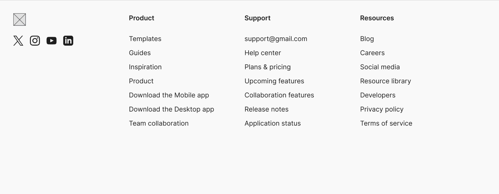

### 4.3.2. Landing Page Mock-up

El mock-up de la página de inicio representa la versión final de alta fidelidad, donde se aplican las guías de estilo para transmitir confianza, modernidad y rigor técnico a las MYPES constructoras.

**Nav y Hero**

Se observa el acabado final del logotipo de Buildline en la esquina superior izquierda. El diseño utiliza una composición limpia con un fondo claro para resaltar los widgets de datos. La tipografía Rubik en el titular principal presenta un contraste jerárquico que facilita la lectura. El botón de llamado a la acción (CTA) en azul tecnológico guía al usuario hacia la conversión inmediata, mientras que la imagen central humaniza la tecnología frente al operario de construcción.

**Workflow**

En esta sección se aplican íconos planos con colores vibrantes para diferenciar las etapas de la cadena de suministro. El diseño utiliza tarjetas con sombras suaves (soft shadows) que generan profundidad, permitiendo que el flujo de Monitoreo, Registros, Alertas y Compliance se perciba como un proceso fluido y sencillo de seguir, alejándose de la complejidad visual de los ERP tradicionales.

**Dashboard y Control Operativo** 

Este bloque integra de manera cohesiva el centro neurálgico de la plataforma. Se visualizan gráficos de anillos y líneas con la paleta de colores funcionales (Verde para éxito, Rojo para alertas de presupuesto). La interfaz del mock-up demuestra la alta densidad de datos de forma organizada, permitiendo que el Jefe de Proyecto identifique rápidamente desviaciones de costos y estados de sensores en almacén sin saturación visual.

**Testimonials** 

El mock-up presenta las tarjetas de testimonios en un formato limpio y minimalista. Se utilizan avatares circulares y una tipografía ligera para las citas, reforzando la credibilidad. El uso de espacios en blanco (whitespace) entre cada testimonio asegura que la "prueba social" sea fácil de digerir, transmitiendo la seguridad que otros profesionales ya experimentan con Buildline.

**Register**

Se muestra el diseño final del formulario de registro, el cual aparece como una capa superpuesta (overlay) con un desenfoque de fondo (backdrop blur). Los campos de entrada tienen estados visuales claros y los botones de registro social (Google/Apple) mantienen la estética minimalista del sistema, reduciendo la carga cognitiva del usuario al momento de crear su cuenta.

**Pricing**

La interfaz de precios utiliza un selector de tiempo (Mensual/Anual) con una transición visual suave. Se aplica un contraste marcado entre el Project Base Plan (claro) y el Multi-Project Enterprise (oscuro/pizarra) para diferenciar visualmente los segmentos de cliente, destacando los beneficios mediante un sistema de check-list limpio y profesional.

**Footer**

El pie de página final utiliza un tono gris pizarra oscuro para marcar el cierre de la navegación. Los íconos de redes sociales y los enlaces están distribuidos con un espaciado modular que garantiza la legibilidad, manteniendo la sobriedad institucional de la startup RQLS.

## 4.4. Web Applications UX/UI Design
### 4.4.1. Web Applications Wireframes

En esta sección se presentan los wireframes diseñados para la aplicación web de RQLS (Buildline). Cada pantalla responde a las funcionalidades principales del sistema de gestión logística y control presupuestal, atendiendo a los roles de usuario definidos: Ingeniero Residente, Jefe de Logística y Gerente General.

**Portal de Inicio - Buildline**

Pantalla principal de presentación donde se ofrecen las opciones de ingreso y registro de nuevas plantas industriales.

**Crear Cuenta - Buildline**

Interfaz de registro inicial diseñada para capturar de forma estructurada los datos del responsable de la constructora, estableciendo los cimientos de la seguridad y el acceso jerárquico al sistema.

**Recuperación de Credenciales - Buildline**

Wireframe del módulo de soporte para el restablecimiento de contraseñas. Proporciona un flujo directo que permite al usuario retomar sus actividades operativas mediante una verificación vía correo electrónico.

**Gestión de Requerimientos de Materiales - Buildline**

Pantalla técnica que centraliza las solicitudes provenientes de obra. Permite la visualización de la Prioridad (Critical/High) y el estado de la validación, integrando un buscador dinámico para la localización rápida de pedidos específicos.

**Panel de Control de Requisiciones - Buildline**

Vista alternativa del módulo de inventario con un enfoque en el seguimiento de estados (Pending Auth, In Transit, Processing, Delivered). Permite al Jefe de Logística tener una visión panorámica del flujo de suministros hacia las distintas obras.

**Dashboard Overview - Buildline**

Panel principal de análisis que consolida los KPIs críticos de la constructora. Muestra métricas de Total Deliveries y Active Personnel, acompañadas de gráficos de tendencia para el monitoreo de la eficiencia operativa.

**Registro de Nuevo Requerimiento - Buildline**

Interfaz de formulario modal (New Material Request) diseñada para que el Ingeniero Residente registre pedidos de insumos de forma ágil. Contiene campos para seleccionar el proyecto, tipo de material, cantidad, unidad de medida y fecha requerida, además de un área de especificaciones técnicas.

### 4.4.2. Web Applications Wireflow Diagrams

Los Wireflows se utilizan, sobre todo, en el diseño de la experiencia del usuario (UX) y son particularmente beneficiosos para aplicaciones que contienen interacciones complejas y flujos de trabajo.

### 4.4.3. Web Applications Mock-ups

En esta sección se presentan los mock-ups de alta fidelidad para la aplicación web de Buildline. Estos diseños finales integran la identidad visual de la marca, tipografías legibles y una arquitectura de información optimizada para la gestión logística en tiempo real.

**Portal de Inicio - Buildline**

Esta interfaz representa el punto de acceso principal al ecosistema de Buildline. Utiliza una composición limpia y moderna que resalta el formulario de autenticación, permitiendo a los usuarios de la constructora ingresar de forma segura o iniciar el proceso de creación de cuenta nueva.

**Crear Cuenta - Buildline**

Diseño final del formulario de registro organizacional. Esta pantalla permite recolectar los datos fundamentales de la constructora y el administrador principal, utilizando una jerarquía visual clara para asegurar la integridad de la información de seguridad.

**Recuperación de Credenciales - Buildline**

Mock-up del flujo de soporte para el restablecimiento de credenciales. La interfaz ha sido diseñada para minimizar la fricción operativa, permitiendo al usuario solicitar un enlace de restauración mediante su correo institucional en pocos pasos.

**Gestión de Requerimientos de Materiales - Buildline**

Mock-up del módulo operativo principal. Presenta una tabla de datos avanzada con estados de validación por colores (Pending, Approved, In Transit), permitiendo al Jefe de Logística supervisar la trazabilidad completa de los materiales desde la obra.

**Panel de Control de Requisiciones - Buildline**

Vista alternativa del módulo de inventario con un enfoque en el seguimiento de estados (Pending Auth, In Transit, Processing, Delivered). Permite al Jefe de Logística tener una visión panorámica del flujo de suministros hacia las distintas obras.

**Dashboard Overview - Buildline**

El dashboard centralizado de Buildline en alta fidelidad. Consolida indicadores críticos como Total Deliveries y Alertas de Inventario mediante tarjetas visuales y gráficos interactivos, facilitando la toma de decisiones estratégicas para la gerencia.

**Registro de Nuevo Requerimiento - Buildline**

Interfaz de formulario modal (New Material Request) diseñada para que el Ingeniero Residente registre pedidos de insumos de forma ágil. Contiene campos para seleccionar el proyecto, tipo de material, cantidad, unidad de medida y fecha requerida, además de un área de especificaciones técnicas.

**Mock-ups Version Mobile**

La sección de Web Applications UX/UI Design presenta la propuesta visual, estructural y de interacción desarrollada para la experiencia móvil de Buildline, el ecosistema SaaS orientado a la gestión integral de adquisiciones, el control de suministros en tiempo real y la trazabilidad de materiales en el sector construcción.

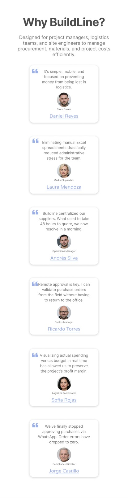

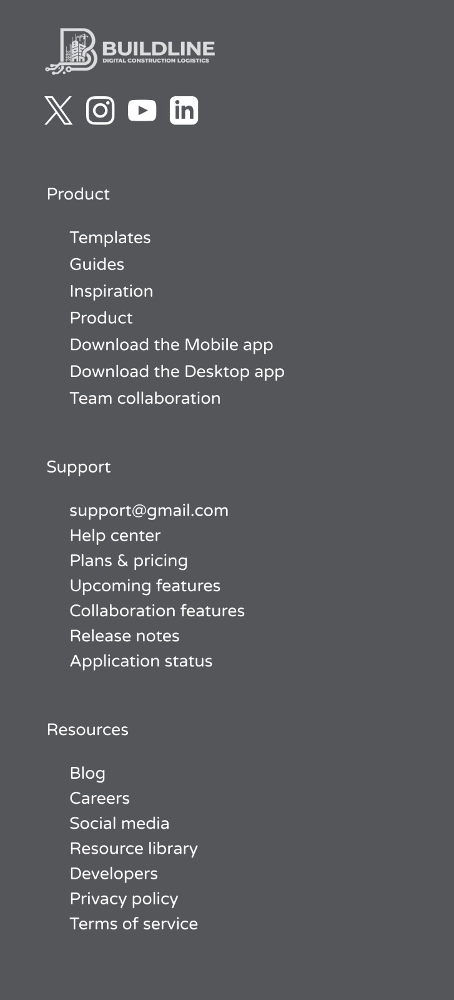

### 4.4.4. Web Applications User Flow Diagrams

Para asegurar una navegación intuitiva y una curva de aprendizaje mínima para nuestros usuarios, se ha definido una simbología estándar basada en colores y formas geométricas. Esta coherencia visual se mantiene en todos los diagramas del sistema.

**Leyenda Visual de Simbología**

**Diagrama 1: Flujo de Autenticación**

Este flujo garantiza que solo personal autorizado (Jefes de Proyecto y Gerentes) acceda a los datos financieros de las obras.

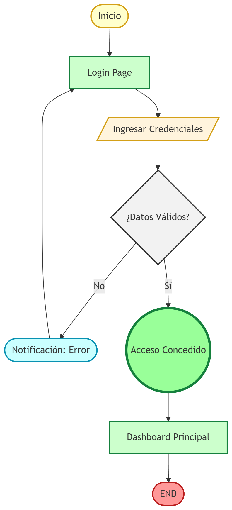

**Diagrama 2: Flujo de Requisición de Materiales**

Representa la interacción del Jefe de Proyecto en el frente de obra al detectar una necesidad de insumos, asegurando que la información llegue formalmente a la oficina.

**Diagrama 3: Flujo Global de Abastecimiento**

Representa el ciclo completo de negocio (Happy Path) que conecta la solicitud en campo con la aprobación gerencial y la emisión del documento de compra.

## 4.5. Web Applications Prototyping

Para validar la arquitectura de información y la eficiencia del flujo de negocio de **Buildline**, se ha desarrollado un prototipo interactivo de alta fidelidad basado en los diagramas de interacción detallados en la sección anterior. Este artefacto permite verificar la fluidez de la interfaz y la respuesta del sistema ante las necesidades críticas del sector construcción.

> [**🔗 Ver Video Prototipo Interactivo - Buildline**](https://upcedupe-my.sharepoint.com/:v:/g/personal/u202316687_upc_edu_pe/IQDfG_KwrXxqSrKx5D7At2JHAb3kkmot9LW_fXuBca38Z_g?nav=eyJyZWZlcnJhbEluZm8iOnsicmVmZXJyYWxBcHAiOiJPbmVEcml2ZUZvckJ1c2luZXNzIiwicmVmZXJyYWxBcHBQbGF0Zm9ybSI6IldlYiIsInJlZmVycmFsTW9kZSI6InZpZXciLCJyZWZlcnJhbFZpZXciOiJNeUZpbGVzTGlua0NvcHkifX0&e=aRAlkn)

## 4.6. Domain-Driven Software Architecture

La arquitectura de software de Buildline se construye a partir de los resultados obtenidos en el Big Picture Event Storming, que permitió comprender en profundidad los flujos clave del dominio de abastecimiento logístico en el sector construcción y las interacciones entre los ingenieros residentes, el área de logística y la gerencia general. A partir de este análisis inicial, se desarrolló una visión más estructurada del dominio utilizando los principios de Domain-Driven Design (DDD).

En las siguientes secciones se presenta cada nivel del modelo, explicando la estructura, responsabilidades y comunicación entre los elementos que conforman la arquitectura de Buildline.

### 4.6.1. Design-Level Event Storming

Para identificar los eventos de dominio y la lógica de negocio, se realizó una sesión de Event Storming. Esta técnica colaborativa permitió visualizar y comprender el flujo de eventos dentro de la cadena de suministro de las MYPES constructoras, facilitando la identificación de los Bounded Contexts que estructurarán el sistema.

El desarrollo del proceso del Domain-Driven Design se realizó en la aplicación Miro: [(https://miro.com/app/board/uXjVHeXoe4U=/?share_link_id=202545251721)]

1. Bounded Context **IAM**

   El bounded context IAM (Identity and Access Management) se encarga de la autenticación, autorización y seguridad dentro de Buildline. Administra el acceso de los diferentes perfiles (Residente de Obra, Analista de Logística y Jefe de Proyecto) garantizando que cada actor solo interactúe con los módulos que le corresponden. Su propósito es asegurar la integridad del acceso al sistema SaaS y gestionar los permisos jerárquicos de aprobación.
   
   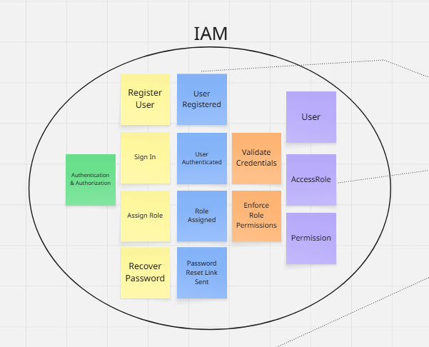

2. Bounded Context **Profiles**

   El bounded context Profiles gestiona la información estática y de configuración de la empresa constructora (MYPE) y los perfiles laborales de su equipo. Administra la creación y actualización de datos de contacto y la estructura organizacional. Su propósito es centralizar la ficha de contacto operativa para que contextos como IAM, Requisition y Procurement sepan exactamente quién está solicitando o aprobando los recursos.
   
   

3. Bounded Context **Requisition**

   El bounded context Requisition representa el punto de inicio operativo en el frente de obra. Administra la creación, priorización y seguimiento de los requerimientos de materiales que realizan los Ingenieros Residentes, incluyendo la adjunción de evidencia técnica. Su propósito es digitalizar la necesidad de la obra, eliminando la informalidad de canales como WhatsApp y centralizando las solicitudes técnicas.
   
   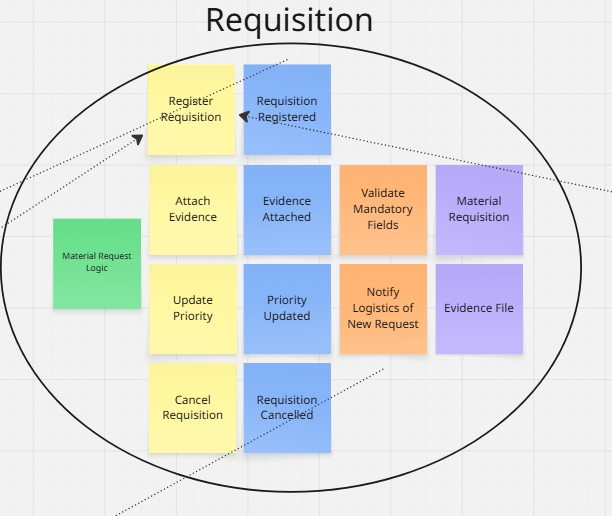

4. Bounded Context **Procurement**

   El bounded context Procurement es el núcleo transaccional en gabinete. Gestiona el ciclo de compras completo: generación de solicitudes de cotización, comparación de ofertas de proveedores y la aprobación jerárquica de la Orden de Compra (PO) por parte de la gerencia. Su propósito es eliminar las compras de emergencia informales y asegurar que todo gasto esté debidamente sustentado y aprobado antes de su ejecución.
   
   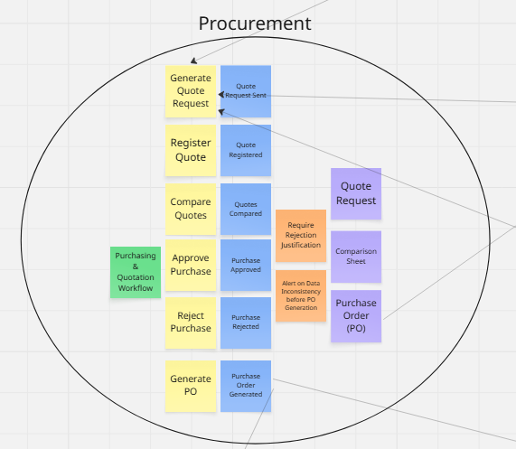

5. Bounded Context **Inventory**

   El bounded context Inventory administra la recepción física de los materiales en la obra y el control de los saldos. Permite al personal en campo confirmar la llegada de insumos y registrar mermas o desperdicios. Se integra estrechamente con Procurement para realizar el cruce de información entre la Orden de Compra y la Guía de Remisión (Way Match), previniendo pérdidas por descontrol de almacén.
   
   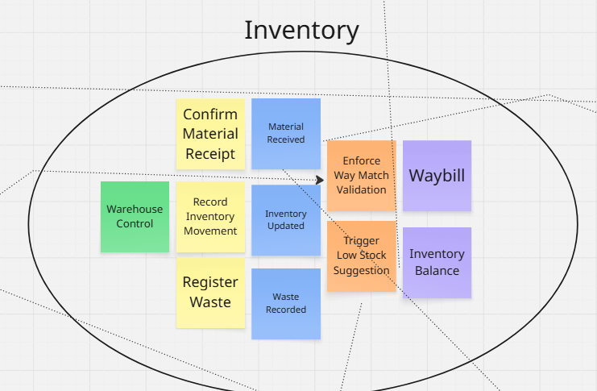

6. Bounded Context **Suppliers**

   El bounded context Suppliers gestiona el directorio, historial de confiabilidad y evaluación de los proveedores de la constructora. Permite registrar nuevos ofertantes, calificar sus tiempos de entrega y documentar incidencias operativas. Su propósito es construir una base de datos confiable que agilice las cotizaciones en Procurement y evite la contratación de empresas con antecedentes deficientes.
   
   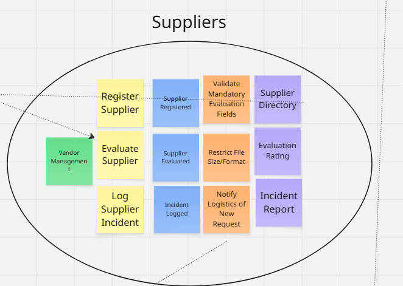

7. Bounded Context **Analytics & Budgeting**

   El bounded context Analytics & Budgeting procesa la información financiera cruzando el presupuesto planificado (APU) con los gastos reales derivados de las órdenes de compra. Permite la visualización de métricas y la detección de desviaciones presupuestales. Su propósito es brindar visibilidad gerencial en tiempo real mediante Dashboards, previniendo el impacto de los sobrecostos logísticos estructurales del sector.
   
   

8. Bounded Context **Communication**

   El bounded context Communication gestiona el envío automatizado de notificaciones internas (alertas de requerimientos críticos, avisos de bajo stock) y correos electrónicos externos (envío formal de Órdenes de Compra a proveedores). Su propósito es asegurar una comunicación oportuna, trazable y estructurada que reduzca los cuellos de botella informativos entre la obra y la oficina central.
   
   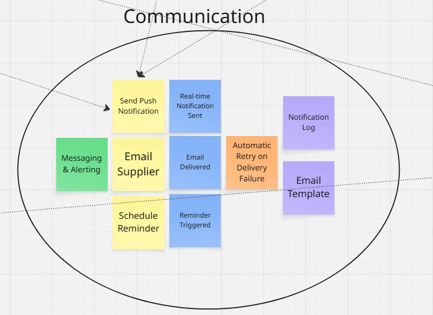

9. Bounded Context **Shared**

   El bounded context Shared contiene elementos transversales, utilidades, el catálogo maestro de materiales y registros de auditoría inmutables utilizados por todos los demás contextos. Su propósito es evitar la duplicidad de lógica de negocio, garantizar la trazabilidad total de las acciones de los usuarios en el sistema y mantener la coherencia semántica en toda la plataforma.
   
   

### 4.6.2. Software Architecture Context Diagram

En este nivel se presenta una vista de alto nivel de la arquitectura, donde el foco está en el sistema de software Buildline como una “caja negra” y en las interacciones que mantiene con sus usuarios y con otros sistemas externos.

El context diagram muestra al **Buildline Software System** como un recuadro en el centro, rodeado por los principales actores y sistemas con los que se comunica:

- **Ingeniero Residente**: usuario interno operativo ubicado en el frente de obra. Interactúa con Buildline para registrar requerimientos de materiales, adjuntar evidencias técnicas y confirmar la recepción física de los despachos.
- **Analista de Logística**: usuario administrativo en oficina responsable de gestionar el ciclo de compras. Interactúa con la plataforma para solicitar cotizaciones, comparar precios y generar las órdenes de compra.
- **Jefe de Proyecto / Gerente**: usuario estratégico que supervisa la viabilidad financiera del proyecto. Consulta la plataforma para monitorear el control de costos (APU) y aprobar o rechazar gastos críticos.
- **SUNAT / Billing API**: sistema gubernamental (o proveedor PSE) externo utilizado para la validación de comprobantes de pago y el cumplimiento de la normativa tributaria local.
- **Email Notification Service**: servicio de correo utilizado para enviar notificaciones transaccionales (alertas de stock, recordatorios) y despachar formalmente las órdenes de compra a los proveedores.
- **Payment Gateway (Stripe)**: sistema externo encargado de procesar el cobro de las suscripciones mensuales (modelo SaaS) asociadas al uso de la plataforma por parte de la constructora.

En el diagrama se representan las relaciones entre estos elementos, destacando que los actores humanos interactúan únicamente con Buildline, mientras que el sistema se encarga de orquestar las integraciones con los servicios externos (validación tributaria, correos y pagos). Esta vista permite entender el alcance del sistema, los límites de responsabilidad y el ecosistema logístico en el que se inserta Buildline antes de entrar a detalles de implementación.

---

### 4.6.3. Software Architecture Container Diagrams

En el nivel de contenedores, la atención se desplaza desde “quién usa el sistema” hacia “cómo se organiza internamente el sistema en aplicaciones y fuentes de datos”. El container diagram muestra los elementos de alto nivel de la arquitectura de Buildline, sus responsabilidades principales y la forma en que se comunican entre sí y con los sistemas externos.

La arquitectura lógica de Buildline se estructura en los siguientes contenedores:

- **Landing Page**: aplicación web estática que presenta la propuesta de valor de Buildline orientada a MYPES constructoras, guía a nuevos usuarios y redirige a la aplicación principal. Está desarrollada con tecnologías web estándar (HTML, CSS y JavaScript) y se despliega en un entorno orientado a contenido estático.
- **Single Page Application (SPA)**: aplicación web principal, implementada en **Angular**, donde interactúan el Ingeniero Residente, el Analista de Logística y el Gerente. Este contenedor concentra la experiencia de usuario, las vistas y la lógica de presentación para los diferentes contextos del dominio (iam, profiles, requisition, procurement, inventory, suppliers, analytics y communication).
- **API Application**: backend implementado con **Spring Boot**, que expone una API REST y encapsula la lógica de negocio, reglas de validación y orquestación de procesos logísticos. Este contenedor agrupa los módulos backend por contexto (IAM Backend, Profiles Backend, Requisition Backend, Procurement Backend, Inventory Backend, Suppliers Backend, Analytics Backend, Communication Backend y Shared Backend).
- **Database**: base de datos relacional **MySQL**, donde se persiste la información estructurada del sistema: usuarios, perfiles de constructoras, requerimientos, cotizaciones, órdenes de compra, inventarios, auditorías y métricas.

En el diagrama se observa que:

- Los usuarios acceden primero a la **Landing Page**, la cual redirige a la **SPA** tras la autenticación.
- La **SPA** se comunica exclusivamente con la **API Application** mediante peticiones **HTTP/HTTPS** con mensajes **JSON**, siguiendo un estilo REST.
- La **API Application** persiste y consulta datos en la **Database** mediante **JDBC** y mapeo objeto–relacional.
- Tanto la **SPA** como la **API Application** interactúan con los sistemas externos: el **Payment Gateway** para suscripciones, la **SUNAT API** para validaciones, y el **Email Notification Service** para el envío de notificaciones y órdenes de compra.

Esta vista permite apreciar cómo se distribuyen las responsabilidades entre la capa de presentación (Landing y SPA), la capa de lógica de negocio (API Application) y la capa de persistencia (Database), así como las principales decisiones tecnológicas que se han tomado para cada contenedor.

---

### 4.6.4. Software Architecture Components Diagrams

En el nivel de componentes se detalla la descomposición interna de los contenedores, mostrando los bloques estructurales que conforman cada uno y las relaciones entre ellos. Dado que la **Single Page Application** y la **Database** ya fueron descritas en otros apartados mediante diagramas de clases frontend y de base de datos, en esta sección se pone especial énfasis en el contenedor **API Application**, donde reside la mayor parte de la lógica de negocio.

El component diagram de la **API Application** agrupa la arquitectura interna siguiendo los bounded contexts definidos en el dominio de Buildline. Cada módulo backend representa un componente principal dentro del contenedor:

- **IAM Backend**: se encarga de la autenticación, gestión de usuarios, roles jerárquicos (Residente, Logística, Gerencia) y validaciones de acceso a la plataforma.
- **Profiles Backend**: gestiona la información de la empresa constructora (MYPE) y los perfiles de los empleados, centralizando los datos de contacto y estructura organizacional.
- **Requisition Backend**: implementa la lógica de las solicitudes de campo, permitiendo registrar requerimientos de materiales, adjuntar evidencias y establecer prioridades.
- **Procurement Backend**: agrupa la funcionalidad del ciclo de compras en oficina, incluyendo la gestión de cotizaciones, generación de cuadros comparativos y emisión de Órdenes de Compra formales.
- **Inventory Backend**: administra el control de almacén en obra, validando la recepción de materiales mediante el cruce de Guías de Remisión con Órdenes de Compra (Way Match) y registrando mermas.
- **Suppliers Backend**: gestiona el directorio de proveedores de la constructora, almacenando historiales de confiabilidad, calificaciones e incidencias operativas.
- **Analytics Backend**: ofrece capacidades de agregación y cálculo cruzando el presupuesto planificado (APU) con los gastos reales, generando KPIs y detectando sobrecostos logísticos.
- **Communication Backend**: orquesta el envío de notificaciones internas en tiempo real (alertas de aprobación, quiebres de stock) y la comunicación externa con proveedores (envío de OCs).
- **Shared Backend**: provee componentes compartidos, utilidades, el catálogo maestro de materiales y el registro inmutable de auditoría utilizado por los demás módulos backend.

En el diagrama se refleja cómo:

- La **SPA** consume los servicios expuestos por cada módulo backend a través de la **API Application**, utilizando endpoints REST específicos por contexto.
- Cada módulo backend accede a la **Database** para leer y escribir la información correspondiente a su contexto (por ejemplo, Requisition Backend a tablas de solicitudes, Procurement Backend a tablas de cotizaciones y OCs).
- Algunos módulos se integran con sistemas externos: el **Procurement Backend** con la API de SUNAT para validar proveedores, y el **Communication Backend** con el servicio de correos.
- Todos los módulos backend reutilizan capacidades comunes provistas por el **Shared Backend**, garantizando que todo material solicitado respete el catálogo maestro y toda acción crítica quede registrada en la auditoría.

De esta forma, los component diagrams complementan los diagramas de clases del frontend, backend y base de datos, mostrando cómo los contenedores se descomponen en componentes coherentes con los bounded contexts del dominio y cómo estos colaboran entre sí para implementar la funcionalidad completa de Buildline.

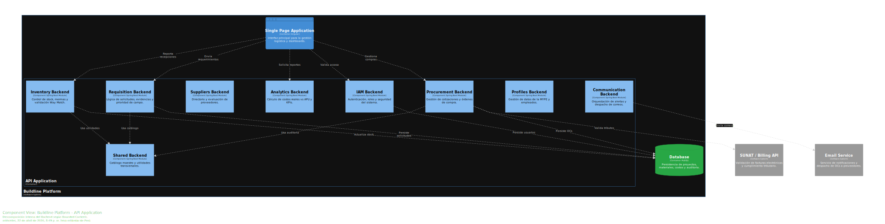

## 4.7. Software Object-Oriented Design
### 4.7.1. Class Diagrams

En esta sección se presenta el diseño orientado a objetos del sistema **Buildline**, el cual desarrolla con mayor detalle la implementación interna de los componentes identificados en los diagramas C4 del apartado anterior. A partir de los contenedores definidos (**API Application** en Spring Boot y **Database** en MySQL), se derivan diagramas de clases específicos para cada *bounded context* del dominio, con el objetivo de mostrar:

- **1. Modelado del Dominio (Backend)**

Cómo se estructuran las entidades, agregados, repositorios y servicios dentro de cada *bounded context* (**IAM, Profiles, Requisition, Procurement, Inventory, Suppliers, Analytics & Budgeting y Communication**), asegurando que la lógica de negocio —como la gestión de requisiciones, la generación de órdenes de compra o el cálculo de desviaciones presupuestarias— se encuentre correctamente encapsulada y alineada a los principios de *Domain-Driven Design*.

- **2. Arquitectura de Aplicación (Backend)**

Cómo se organizan los servicios de aplicación y las interfaces de repositorio que orquestan los casos de uso del sistema, permitiendo la interacción entre los distintos contextos sin acoplar directamente sus modelos internos.

- **3. Diseño de Persistencia (Database)**

Cómo las entidades del dominio se mapean a estructuras relacionales en la base de datos, garantizando la integridad de la información, la trazabilidad de las operaciones y el soporte a consultas clave del negocio, como el seguimiento de requerimientos, órdenes de compra y control presupuestal.
A nivel de backend, los diagramas de clases reflejan la implementación de la **API Application** siguiendo principios de *Domain-Driven Design (DDD)*, donde cada *bounded context* encapsula su lógica de negocio y su modelo de datos de forma independiente, manteniendo bajo acoplamiento y alta cohesión.

**Backend completo**

Ilustra la estructura general del sistema organizada por *bounded contexts*, mostrando cómo cada módulo (**IAM, Profiles, Requisition, Procurement, Inventory, Suppliers, Analytics & Budgeting y Communication**) define sus propias entidades, servicios y repositorios, alineados al dominio de la gestión de abastecimiento en constructoras.

- **Shared**

Concentra componentes transversales como **MaterialCatalog**, **AuditLog** y el objeto de valor **Money**, los cuales son reutilizados por múltiples contextos para garantizar consistencia en la representación de datos, trazabilidad de operaciones y manejo de valores monetarios.

- **IAM**

Incluye clases como **UserAccount**, **SessionToken** y **AuthService**, responsables de la autenticación, gestión de sesiones y control de acceso basado en roles dentro del sistema.

- **Profiles**

Modela las entidades **EmployeeProfile** y **CompanyProfile**, junto con los servicios encargados de gestionar la información organizacional de la empresa constructora y sus usuarios.

- **Requisition**

Contiene las clases **Requisition** y **RequisitionItem**, que representan las solicitudes de materiales generadas desde obra, junto con los servicios que gestionan su creación, priorización y seguimiento.

- **Procurement**

Agrupa las entidades **PurchaseOrder** y **Quote**, junto con los servicios que implementan el flujo de compras, incluyendo la comparación de cotizaciones y la generación de órdenes de compra.

- **Inventory**

Incluye clases como **InventoryItem** y **GoodsReceipt**, encargadas de registrar la recepción de materiales en obra, actualizar el stock y validar la correspondencia con las órdenes de compra.

- **Suppliers**

Modela la entidad **Supplier** y los servicios asociados a su gestión, permitiendo mantener un registro estructurado y evaluable de proveedores.

- **Analytics & Budgeting**

Contiene clases como **Budget**, **CostRecord** y **DeviationReport**, responsables de procesar la información financiera, calcular desviaciones presupuestarias y generar métricas para la toma de decisiones.

- **Communication**

Incluye entidades como **Notification** y **Recipient**, junto con servicios que gestionan el envío de notificaciones internas y comunicaciones relevantes dentro del flujo operativo.

### Diagrama de Clases Backend ###

- **Diagrama Completo**
  
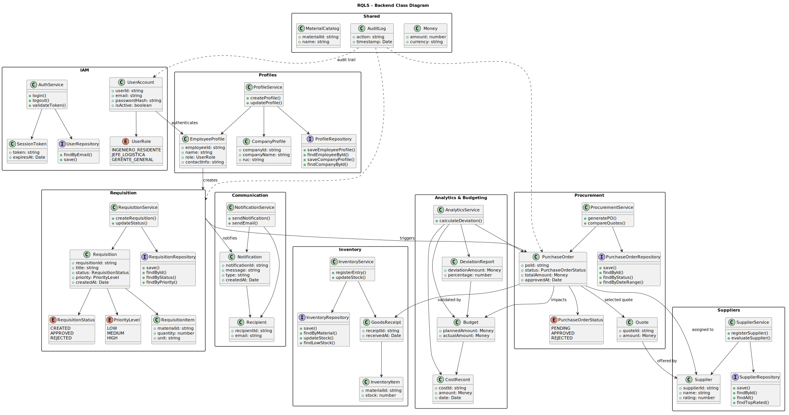

### Diagrama dividido por contextos ###

- **Shared**
   
  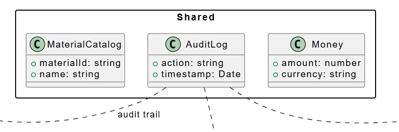

- **IAM**
   
  

- **Profiles**
   
  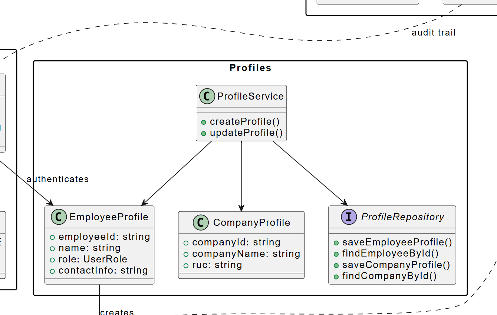

- **Requisition**
  
  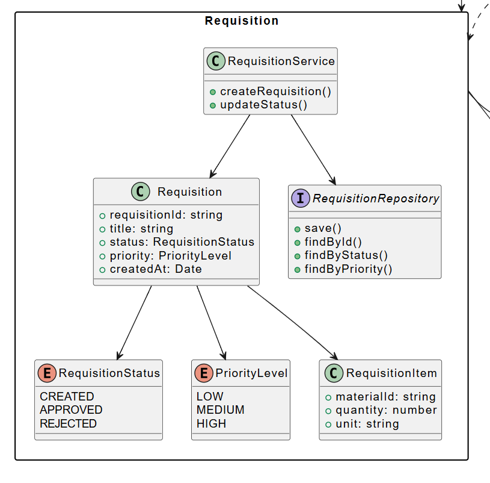

- **Communication**
   
  

- **Inventory**
   
  

- **Analytics & Budgeting**
    
  

- **Procurement**
  
  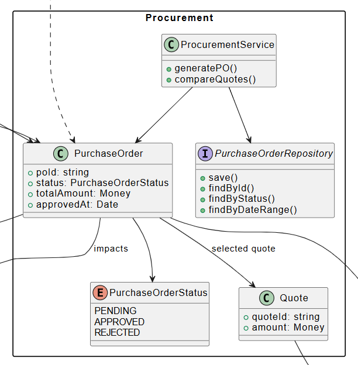

- **Suppliers**
  
  

## 4.8. Database Design

Ilustra la estructura general del sistema a nivel relacional, organizada por *bounded contexts*, mostrando cómo cada módulo (**IAM, Profiles, Requisition, Procurement, Inventory, Suppliers, Analytics & Budgeting y Communication**) define sus propias tablas, relaciones y restricciones, manteniendo coherencia con el dominio de la gestión de abastecimiento en constructoras.

### 4.8.1. Database Diagrams

- **Diagrama Completo**

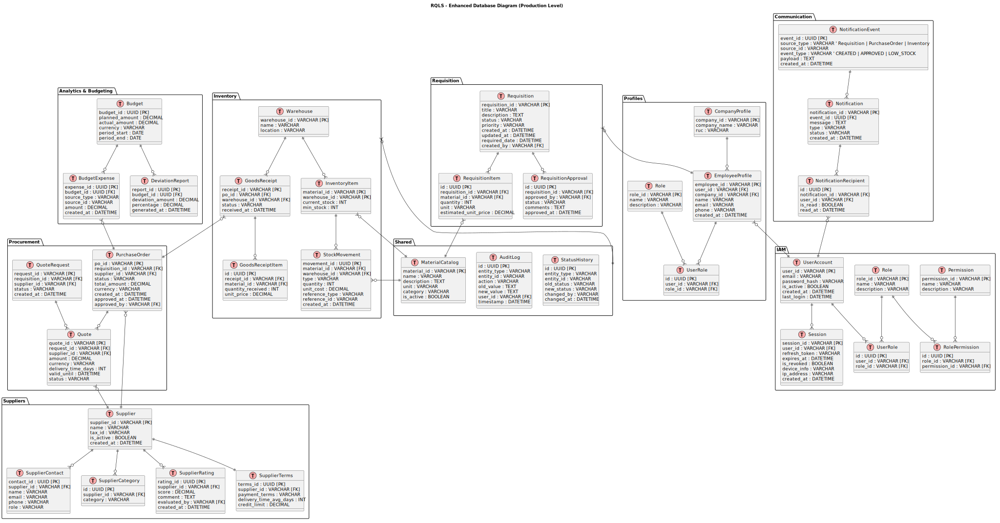

### Diagrama dividido por contextos

- **Shared**  
  

- **IAM**  
  

- **Profiles**  
  

- **Requisition**  
  

- **Procurement**  
  

- **Inventory**  
  

- **Suppliers**  
  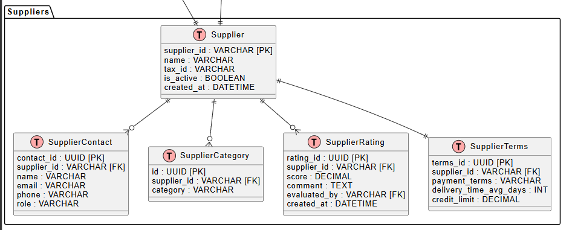

- **Analytics & Budgeting**  
  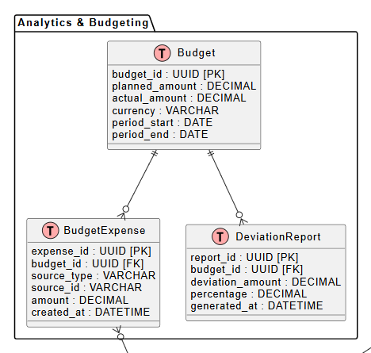

- **Communication**  
  
